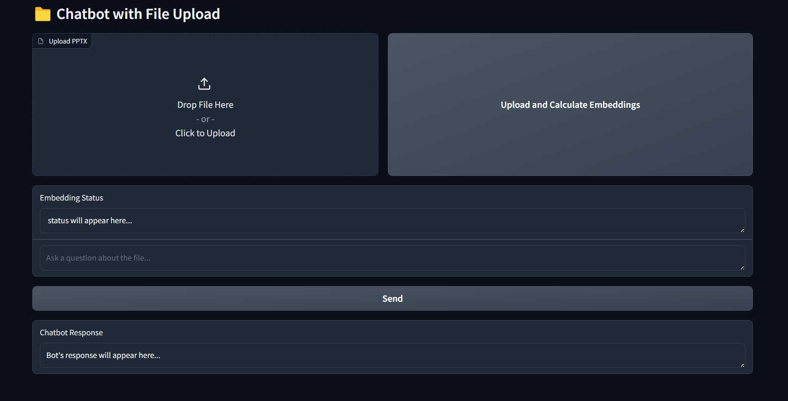

<h2>RAG-Based Gradio Application with FAISS and Open-Source LLM</h2>

This project demonstrates a Retrieval-Augmented Generation (RAG) pipeline integrated into a Gradio UI. Users can upload documents, store embeddings in a FAISS index, and generate answers to queries using an open-source language model.

<h4>Key Features</h4>

File Upload: Users can upload PDF and PPTX files through the Gradio interface.

Backend Embedding Storage: Click the "Store Embeddings" button to generate and store text embeddings from uploaded files in FAISS.

Query Generation: Users can type queries and click "Generate Answer" to receive responses from the LLM based on the stored data.

Efficient Document Retrieval: Leveraging FAISS for vector-based similarity search.

<h4>Tech Stack :</h4>

Python 3.8+

LangChain for document processing

HuggingFace Transformers for LLM and embeddings

FAISS for efficient vector similarity search

<h4>Run the Project:</h4>

python UI_upload_file_chat_bot.py

<h4>UI Layout</h4>
 

